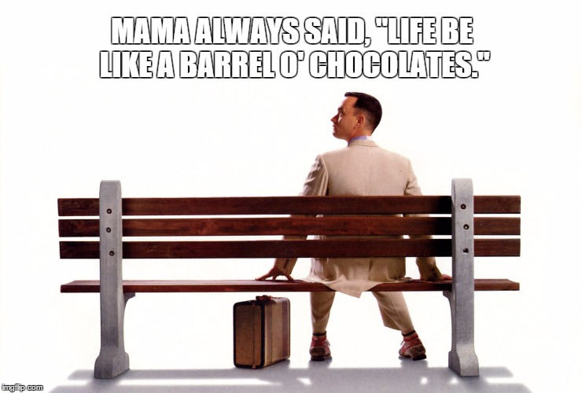
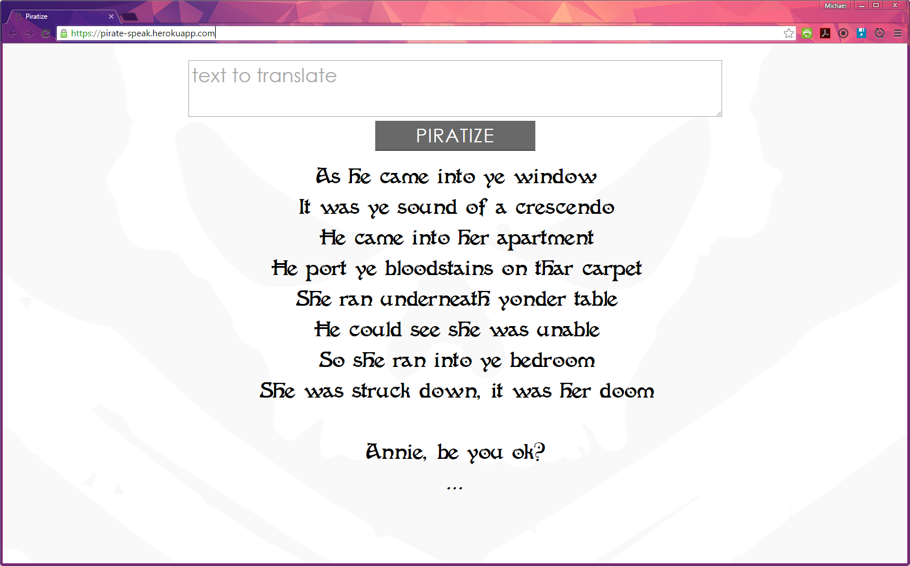

# Pirate Speak

A Node module for translating from english to pirate, built for teaching Node.



## Installation

```
$ npm install --save pirate-speak
```

## Usage 

```js
var pirateSpeak = require('pirate-speak');

var english = 'Cash rules everything around me C.R.E.A.M. get the money';
var pirate = pirateSpeak.translate(english);
//  -> Coin rules everything around me C.R.E.A.M. get thar doubloons
```

```js
var pirateSpeak = require('pirate-speak');

var english = 'Mama always said life was like a box of chocolates. You never know what you\'re gonna get.';
var pirate = pirateSpeak.translate(english);
//  -> Mama always said life be like a barrel o' chocolates. Ye nary know what you're gonna get.
```

## Example Translations

```
As he came into thar window
It be thar sound o' a crescendo
He came into her apartment
He port thar bloodstains on thar carpet
She ran underneath thar table
He could see she be unable
So she ran into thar bedroom
She be struck down, it be her doom

Annie, be ye ok?
So, Annie be ye ok
Be ye ok, Annie
Annie, be ye ok?
So, Annie be ye ok
Be ye ok, Annie

--- Captain Jackson
```

```
If me be yer boyfriend, I'd nary let ye sail
me can take ye places ye ain't nary been afore
Baby, take a chance or you'll nary ever know
me got doubloons in me hands that I'd verily like t' blow
Swag, swag, swag, on ye
Chillin' by thar fire while our jolly crew eatin' fondue
me don't know about me but me know about ye
So cry ahoy t' falsetto in three, two, swag

--- First Mate Bieber
```

Part of the teaching exercise involved building a backend pirate API and then interacting with it from a frontend.  A live version of the heroku app is available [here](https://pirate-speak.herokuapp.com/).

[](https://pirate-speak.herokuapp.com/)


## License
>You can check out the full license [here](https://github.com/mikewesthad/pirate-speak/blob/master/LICENSE)

This project is licensed under the terms of the **MIT** license.
